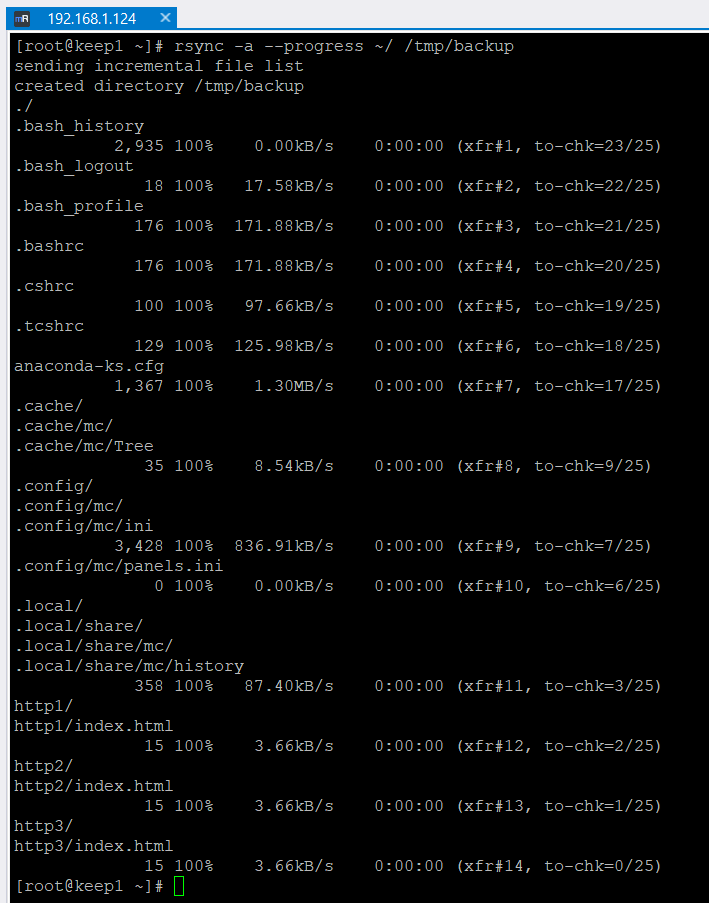

# Домашнее задание к занятию "`Резервное копирование`" - `Дедюрин Денис`

---

## Задание 1

* Составьте команду rsync, которая позволяет создавать зеркальную копию домашней директории пользователя в директорию /tmp/backup
* Необходимо исключить из синхронизации все директории, начинающиеся с точки (скрытые)
* Необходимо сделать так, чтобы rsync подсчитывал хэш-суммы для всех файлов, даже если их время модификации и размер идентичны в источнике и приемнике.
* На проверку направить скриншот с командой и результатом ее выполнения


1. `Команда для создания зеркальной копии домашней директории пользователя в директорию /tmp/backup`
```
rsync -a --progress ~/ /tmp/backup
```



2. `Исключаем из синхронизации все директории, начинающиеся с точки`
```
rsync -a --progress --exclude='/.*' ~/ /tmp/backup
```


3. `Заполните здесь этапы выполнения, если требуется ....`
4. `Заполните здесь этапы выполнения, если требуется ....`
5. `Заполните здесь этапы выполнения, если требуется ....`
6. 

```
....
....
....
....
```

---

## Задание 2

* Написать скрипт и настроить задачу на регулярное резервное копирование домашней директории пользователя с помощью rsync и cron.
* Резервная копия должна быть полностью зеркальной
* Резервная копия должна создаваться раз в день, в системном логе должна появляться запись об успешном или неуспешном выполнении операции
* Резервная копия размещается локально, в директории /tmp/backup
* На проверку направить файл crontab и скриншот с результатом работы утилиты.


`Приведите ответ в свободной форме........`

1. `Заполните здесь этапы выполнения, если требуется ....`
2. `Заполните здесь этапы выполнения, если требуется ....`
3. `Заполните здесь этапы выполнения, если требуется ....`
4. `Заполните здесь этапы выполнения, если требуется ....`
5. `Заполните здесь этапы выполнения, если требуется ....`
6. 

```
Поле для вставки кода...
....
....
....
....
```
